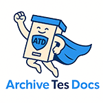

# ArchiveTesDocs


ArchiveTesDocs est un logiciel dédié à la gestion d'archives et de documents papiers au sein d'une entreprise ou d'une organisation.

## Gérer vos archives et leurs mouvements, simplement !

ArchiveTesDocs a été conçu pour vous simplifier au maximum la gestion de vos documents sous format papier. Simple et ludique, il s’adresse aux entreprises qui possèdent des salles d’archives en interne et / ou qui ont des documents chez un ou plusieurs prestataires d’archivage.
Grâce à cet outil, vous pourrez conserver votre indépendance vis-à-vis des stockeurs, mais également gérer facilement vos documents ainsi que les délais de conservation, accéder aux statistiques des mouvements d’archives réalisés ou bien encore personnaliser l'outil par service et par utilisateur. La traçabilité et l’accessibilité de vos documents seront alors garanties.

## Opensource

En 2025, grâce à un partenariat entre IDP Consulting, premier éditeur du logiciel, dirigé par Richard Collot et titulaire des droits, ACConseil, dirigé par Anne Collot (conceptrice du logiciel) et IdéesCulture, spécialiste du logiciel libre pour les collections culturelles, ArchiveTesDocs bascule sous licence OpenSource. 
Notre partenariat nous permet de vous proposer hébergement de la solution, déploiement, paramétrage, formation, migration des données...

## Fonctionnalités
- gestion de salles d'archives
- création de boîtes d'archives, identification, description, génération d'étiquettes pour l'archivage
- gestion multisite
- gestion des mouvements d'archives
- gestion des délais de conservation

## Développement
Actuellement, ArchiveTesDocs utilise Symfony 3.3 et PHP 7. Le passage dans les dernières version de Symfony est visé en 2025.

## Installation

*Répertoire des fichiers temporaires*
```
mkdir -p var/tmp/IDPUserFiles
chmod 755 var/tmp/IDPUserFiles
```
